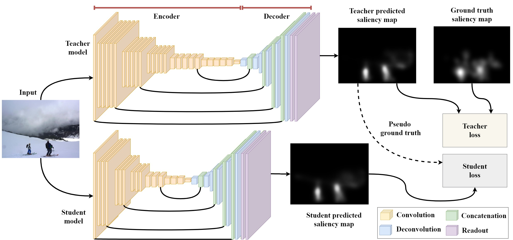

# On-device Saliency Prediction based on Pseudo Knowledge Distillation

**This paper has been accepted to IEEE Transactions on Industrial Informatics (IEEE TII).**

Paper: [IEEE Transactions on Industrial Informatics](https://ieeexplore.ieee.org/document/9720080)

This offical implementation of PKD (Pseudo Knowledge Distillation) from On-device Saliency Prediction based on Pseudo Knowledge Distillation by [Chakkrit Termritthikun](https://chakkritte.github.io/cv/).

<p align="center">
  
</p>

**This code is based on the implementation of  [EML-NET-Saliency](https://github.com/SenJia/EML-NET-Saliency), [SimpleNet](https://github.com/samyak0210/saliency), [MSI-Net](https://github.com/alexanderkroner/saliency), and [EEEA-Net](https://github.com/chakkritte/EEEA-Net).**

## Prerequisite for server
 - Tested on Ubuntu OS version 20.04.x
 - Tested on PyTorch 1.10.2 and TorchVision 0.11.3
 - Tested on NVIDIA V100 32 GB (four cards)

### Cloning source code

```
git clone https://github.com/chakkritte/PKD/
cd PKD
```

### Creating new environments

```
conda create -n pkd python=3.6
conda activate pkd
conda install pytorch torchvision torchaudio cudatoolkit=11.3 -c pytorch
```

### Install Requirements

```
pip install -r requirements.txt
```

## Usage

### Training Salicon dataset (Teacher: OFA595, Student: EEEA-C2)
```
python main.py --student eeeac2 --teacher ofa595 --dataset salicon --model_val_path model_salicon.pt
```

## Architecture Transfer


### Training MIT1003 dataset (Teacher: OFA595, Student: EEEA-C2)
```
python main.py --student eeeac2 --teacher ofa595 --dataset mit1003 --model_val_path model_mit1003.pt
```

### Training CAT2000 dataset (Teacher: OFA595, Student: EEEA-C2)
```
python main.py --student eeeac2 --teacher ofa595 --dataset cat2000 --model_val_path model_cat2000.pt
```

### Training PASCALS dataset (Teacher: OFA595, Student: EEEA-C2)
```
python main.py --student eeeac2 --teacher ofa595 --dataset pascals --model_val_path model_pascals.pt
```

### Training OSIE dataset (Teacher: OFA595, Student: EEEA-C2)
```
python main.py --student eeeac2 --teacher ofa595 --dataset osie --model_val_path model_osie.pt
```

## Citation

If you use PKD or any part of this research, please cite our paper:
```
@ARTICLE{9720080,
  author={Umer, Ayaz and Termritthikun, Chakkrit and Qiu, Tie and Leong, Philip Heng Wai and Lee, Ivan},
  journal={IEEE Transactions on Industrial Informatics}, 
  title={On-device Saliency Prediction based on Pseudo Knowledge Distillation}, 
  year={2022},
  volume={},
  number={},
  pages={1-1},
  doi={10.1109/TII.2022.3153365}}
```

## License 

Apache-2.0 License
